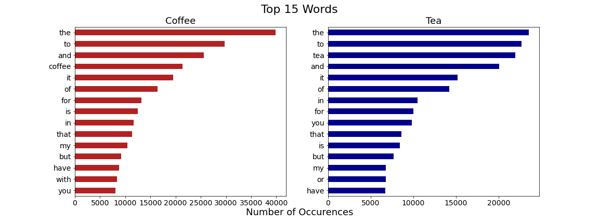
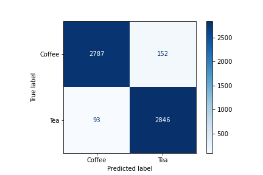
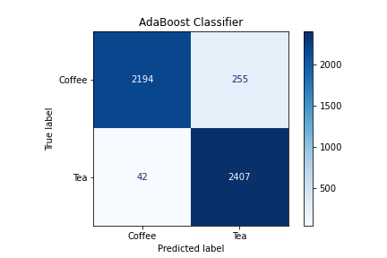
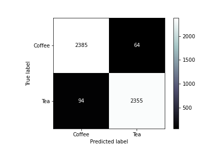

# Project 3: Web APIs & NLP

## Executive Summary

## Problem statement
As a data scientist hired by an up and coming coffee and tea company tasked with looking to leverage data to provide some insights that can aid sales strategies. This project uses NLP to help train a classifier on whether a post came from the coffee subreddit or tea subreddit.  By deploying the push shift API in a manner where we can automate a vast web scrape we can get a substantial amount of posts for the purpose of this project.  We will compare the respective performances of different classification models. We can gauge success by comparing it to a baseline model and whether the model exceeds this.  The stakeholders at the coffee and tea company would be interested to see what words or combination of words are of most use. This study may be of interest to numerous people as coffee and tea are two of the three most popular beverages in the world (alongside water) and two of the most profitable international commodities.  While not all coffee and teas are caffeinated, many throughout the globe who enjoy these beverages attribute their popularity to the invigorating effect produced by caffeine(Myhrvoid, N., 2021).

References:

https://www.britannica.com/topic/coffee 
https://www.britannica.com/topic/tea-beverage 
https://www.pbs.org/food/the-history-kitchen/history-coffee/

## Description of Dataset

### Datasets Collection

Dataset was obtained by using the pushshift api function in order to webscrape reddit and specifically the following two subreddits:coffee & tea. Each of these sets will include the following columns, the posts and the subreddit name it came from.  
- [`coffee.csv`](../data/coffee.csv): Coffee subreddit posts
- [`tea.csv`](../data/tea.csv): Tea subreddit posts

### Data Dictionary
|Feature|Type|Dataset|Description|
|---|---|---|---|
|post|*object*|coffee/tea|A post within a subreddit|
|subreddit|*object*|coffee/tea|Subreddit by category|
|post_len|*int*|coffee/tea|Length of a post|
|word_count|*int*|coffee/tea|The word count within a post|

## Data Visualizations & Analysis

We can see that words like "the", "to","and","it round out most of the top five.  We can see it diverges with the words coffee and tea respectively, which makes sense as they are the subject matter in the subreddits.

")

When we filter out the stop words and add a bit more context by looking at word pairings, we can see that in the coffee subreddit there is a strong presence with brewing methods such as "french press, espresso machine, cold brew, moka pot and coffee maker".  Whereas in the tea subreddit its more about the product itself "green tea, black tea, loose leaf, ve oolong".  

")
When comparing the word count distributions for each subreddit, you can see two examples of extremely right-skewed distributions.  People tend to write less than 500 word messages on both subreddits.

")
The distributions for length of each posts closely shadows the word count distribution. Length of posts look to be slightly higher in the coffee subreddit.

## Evaluating the models

We will evaluate this classification problem from the lens of accuracy, recall, specificity, Type I and Type II.  Recall allows you to know when you correctly predicted the cases in the true class. The true class in this case is the tea subreddit. Specificity lets you find out how well you can predict the negative class, which is the coffee subreddit. Finally with Type I & Type II errors you can see the percentage at which your model incorrectly predicts these classes respectively.

References: 
https://towardsdatascience.com/the-3-most-important-basic-classification-metrics-3368dd425f74 
https://towardsdatascience.com/the-3-most-important-composite-classification-metrics-b1f2d886dc7b

## Classification models

### Multinomial Naive Bayes Model

**Specificity** - This model correctly predicted 94.8% of the posts in the coffee subreddit.

**Recall** - This model correctly predicted 96.8% of the posts in the tea subreddit.

**Type I error:** This model incorrectly predicted 5.2% of the posts belonging to the coffee subreddit.

**Type II error:** This model incorrectly predicted 3.2 % of the posts in the tea subreddit.

### Multinomial NB/CountVectorizer(stopwords)

 Confusion Matrix")

**Specificity** - Among those in the coffee subreddit post 95.4% were predicted correctly via this model.

**Recall** - This model correctly predicted 96.4% of the posts belonging in the tea subreddit.

**Type I error:** The model incorrectly predicted 3.8% of the posts in the coffee subreddit.

**Type II error:** The model incorrectly predicted 3.6% of the posts belonging to tea subreddit.

### RandomForest Classification(Pipeline/Gridsearch)

")

**Specificity** - Among posts in the coffee subreddit, 96.1% are correctly predicted via this model.

**Recall** - The model correctly predicted 96.8% of the posts in the tea subreddit.

**Type I error:** This model incorrectly predicted 3.8% of the posts in the coffee subreddit.

**Type II error:** This model incorrectly predicted 3.2% of the posts in the tea subreddit.

### Adaboost Classification

**Specificity** - Among posts in the coffee subreddit 89.6% are correctly predicted via this model.

**Recall** - The model correctly predicted 98.3% of the posts in the tea subreddit.

**Type I error:** This model incorrectly predicted 10.4% of the posts in the coffee subreddit.

**Type II error:** This model incorrectly predicted 1.7% of the posts in the tea subreddit.

### Logistic Regression(TFID & Gridsearch)

**Specificity** - This model accurately predicted 97.3% of the posts in coffee subreddit.

**Recall** -  This model accurately predicted 96.2% of the posts in the tea subreddit.

**Type I error:** This model incorrectly predicted 2.6% of the posts in the coffee subreddit.

**Type II error:** This model incorrectly predicted 3.9% of the posts in the tea subreddit.

### Random Forest(TFID/Gridsearch)

")

**Specificity** - This model accurately predicted 96.1% of the posts in coffee subreddit.

**Recall** -  This model accurately predicted 96.5% of the posts in the tea subreddit.

**Type I error:** This model incorrectly predicted 3.9% of the posts in the coffee subreddit.

**Type II error:** This model incorrectly predicted 3.5% of the posts in the tea subreddit.

### Conclusion & Recommendations

Our client tasked us with finding some insights for them to help aid their sales strategies.  We were able to find some of the top word pairs for each particular subreddit and could gather some insight.  For the coffee subreddit we saw word pairs such as french press, espresso machine, cold brew, moka pot and coffee maker.  These are brewing methods that can help guide us into looking at more data. You can target the segment of customers by providing a variety of brewing methods at a coffee shop. Another way to approach it could be to sell this variety of equipment through all your sales channels(online, retail, etc.).  On the tea side of things you see the words centered around the variety of teas, green tea, black tea, loose lead, and oolong.  These conversations seem more centered around the plant themselves, a coffee/tea company may then want to examine their offerings in terms of quality and variety to target those customers.  The Logistic Regression here helps in that we can at least be assured that these word pairings are coming from the subreddit that they are predicted to come from.  We have a specificity score of 97.4% which tells us how well we predicted posts in the coffee subreddit. Our recall is 96.2% which is how well they predicted the posts in the tea subreddit.

### Next Steps

Of course we cannot just run with a recommendation without further information but there is something to this cultural difference between tea and coffee enthusiasts.  Looking at the company's sales data could also help us with regard to what features contribute to sales and how relevant the findings from this project are. We could improve the models by grid searching through more ngrams. Also, customizing the stop words in order to get rid of website hyperlinks and such.
